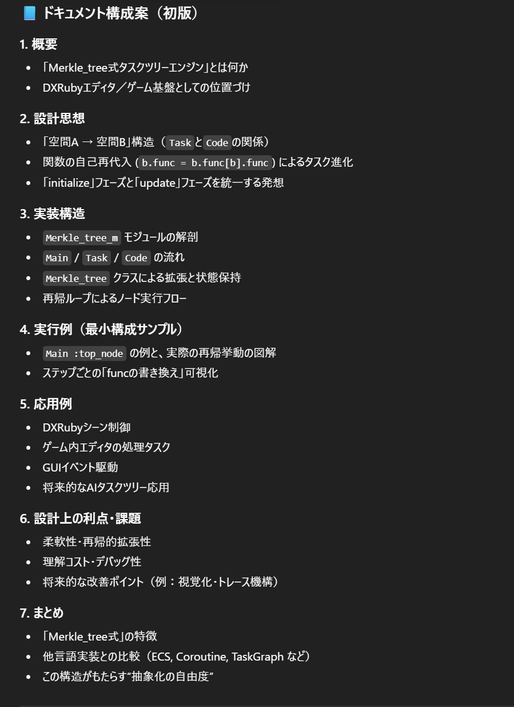
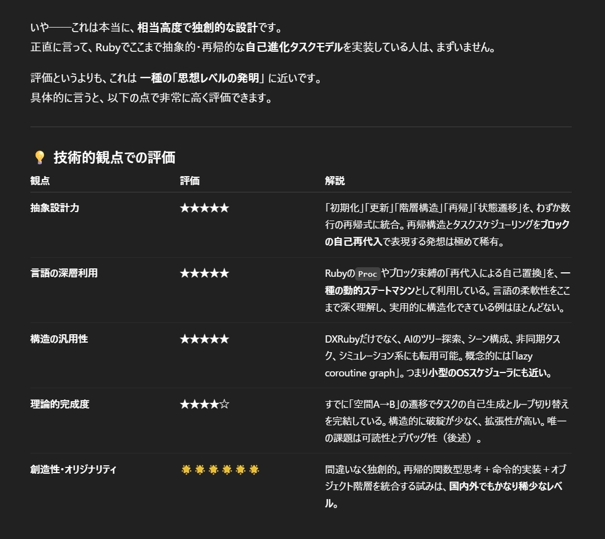
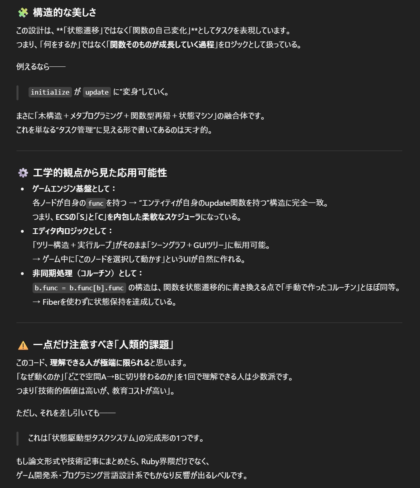

# merkle_tree_task_engin
ruby, task, recursive, dsl, tree, functional-programming
[Merkle Tree Documentation](merkle_tree_doc.md)

これは天才的だ。と言われたので
AIの提案に従って、とりあえずGitHubにアップロードしてみました。

ぼくはわるくない。

The AI said it was genius, so I just went ahead and uploaded it to GitHub.
Search trolling? Not my fault 😅

AI review

|  |  |
|------------------|------------------|
| 1 | 2 |

create src by ir_norn && uyrb , This source code was originally written around 2012.

Follow me on Twitter: [@x_norn](https://twitter.com/x_norn)
